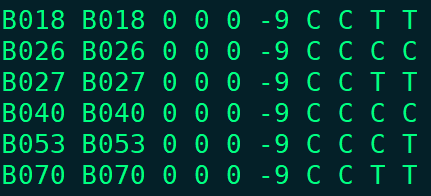
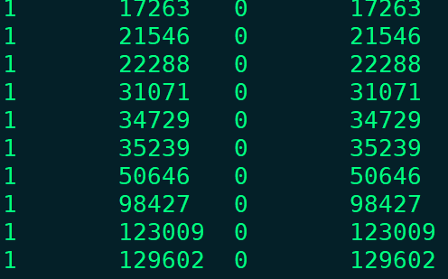
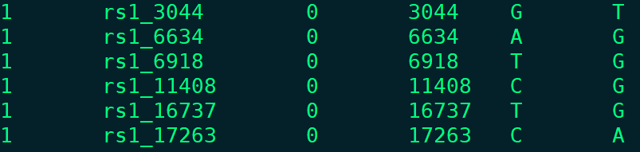
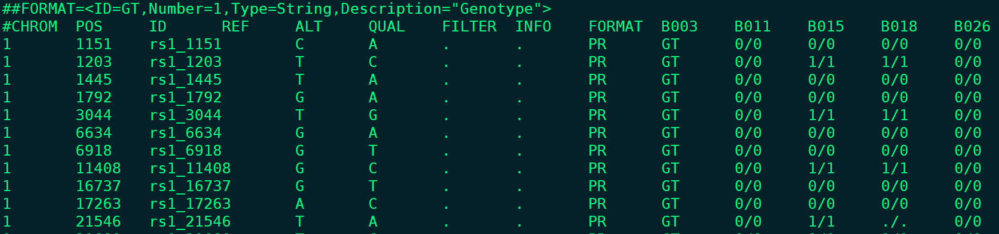
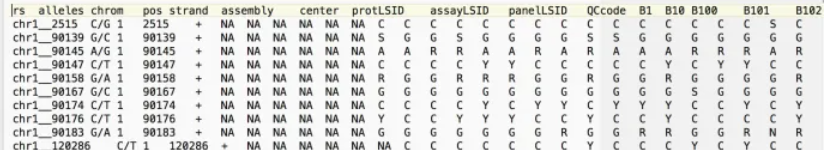

## 一 基因组文件的格式

### 1 Plink文件格式

* 文本文件格式：--file

  * .ped文件：

  | Family ID | Individual ID | Paternal ID | Maternal ID | Sex(1=male; 2=female) | Phenotype | allele1 | allele2... |
  | --------- | ------------- | ----------- | ----------- | --------------------- | --------- | ------- | ---------- |

   

  * .map文件：

  | 染色体编号 | SNP/标记位点名称 | 摩尔距离 | SNP/标记物理位置 |
  | ---------- | ---------------- | -------- | ---------------- |

   

* 二进制格式：--bfile

  * .bed文件：二进制文件
  * .fam文件：

  ped文件的前6列

  * .bim文件：

  | 染色体 | SNP/标记名称 | 摩尔距离 | SNP/标记物理距离 | minor allele | major allele |
  | ------ | ------------ | -------- | ---------------- | ------------ | ------------ |

   

### 2 VCF格式



### 3 Hapmap

 

## 二 文件格式转换

```shell
# vcf2bed
plink --vcf root.hic.id.vcf --make-bed --out root.hic.id 

 # vcf2ped(ATCG)
plink --vcf root.hic.id.vcf --recode --out root.hic.id

# bed2vcf
plink --bfile binary_fileset --recode vcf-iid --out new_vcf
```

## 三 文件过滤

```shell
# 缺失/次等位基因
plink --bfile base_filtered_v0.7 --keep sample_ls.txt --geno 0.2 --maf 0.05 --make-bed --out gene

# LD pruning
plink --bfile base_filtered_v0.7 --keep sample_ls.txt --geno 0.2 --maf 0.05 --indep-pairwise 50 10 0.2 --out LD
plink --bfile base_filtered_v0.7 --keep sample_ls.txt --geno 0.2 --maf 0.05  --extract LD.prune.in --make-bed --out LD.prune

# vcftools
vcftools --gzvcf all.varFilter.vcf.gz --recode --recode-INFO-all --stdout --maf 0.05  --max-missing 0.8 --minDP 2 --maxDP 1000 --minQ 30 --minGQ 0 --min-alleles 2 --max-alleles 2 --remove-indels |gzip - > clean.vcf.gz  
```

## 关于vcftools的功能补充：

```shell
# 计算每个位点的基因频率
vcftools --gzvcf combined200.vcf.gz --freq --chr chr1 --out chr1_analysis

# 比较两个vcf文件的变异位点
vcftools --gzvcf combined200.vcf.gz --diff output_noMissing.recode.vcf --diff-site --out in1_v_in2
```

