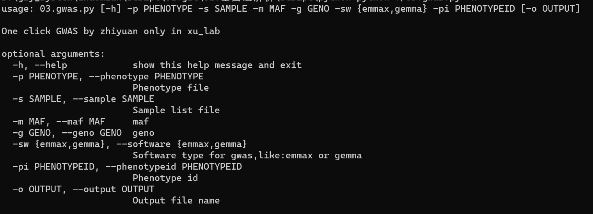
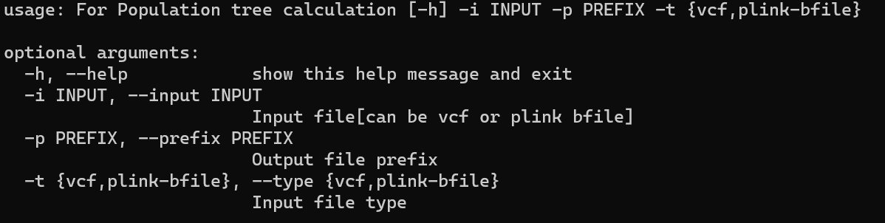
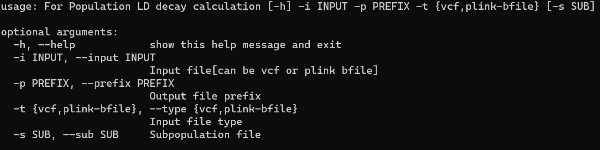
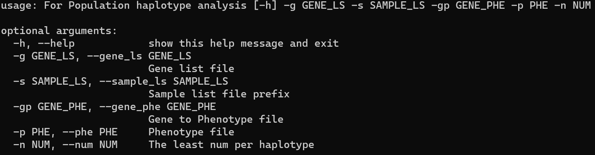

## 1 GWAS

* mix model：

```shell
python ./script/python/03.gwas.py -p phenotype_file.txt -s sample_file.txt -m 0.05 -g 0.2 -sw gemma -o phe1_result.txt -pi phenotype_id
```



* FarmCPU

```shell
# 制备geno和info文件
python ./script/Dependent_files/vcf2num.py *.vcf outfile_prefix

# 制备协变量文件
plink --bfile LD.prune --pca 5
awk -F " " 'BEGIN{print "Taxa\tQ1\tQ2\tQ3\tQ4\tQ5"}{print $1"\t"$3"\t"$4"\t"$5\t$6\t$7}' plink.eigenvec > farmcpu.cov

# 进行GWAS
Rscript ./script/R/FarmCPU_GWAS_Rscript.v4.R --genofile /outfile_prefix.geno --phenofile phe.txt --snpposinfo outfile_prefix.info --covariate farmcpu.cov --outpath ./result
```

## 2 tree

```shell
python ./script/python/02.tree.py -i *.vcf -p outputfile_prefix -t vcf
```



## 3 LD

```sh
python ./script/python/01.ld.py -i *.vcf -p output_prefix -t vcf -s subpopulation_file
```



## 4 单倍型

```sh
python ./script/python/04.hap.py -g gene_ls_file -s sample_ls_file -gp gene_with_file -p phenotype_file -n least_num_per_haplotype
```



## 5 群体结构分析

```sh
# 获取数值型ped文件
plink --noweb --bfile LD.prune --recode12 --out admixture --allow-extra-chr --keep-allele-order

# 进行admixture分析
for k in {2..10};do
    admixture -j2 -C 0.01 --cv admixture.ped $k >admixture.log$k.out
done
```

## 6 选择清除分析

* 整个基因组

```sh
# 将所有染色体合并成一条染色体
python ./script/Dependent_files/all2one_chri.py *.vcf out.vcf
# 计算Pi和Fst
vcftools --vcf allinone.vcf --keep cA.txt --out cA.pi --window-pi 373083310 --window-pi-step 373083310
vcftools --vcf allinone.vcf --weir-fst-pop cA.txt --weir-fst-pop cB.txt --out ca_cb_fst --fst-window-size 373083310 --fst-window-step 373083310
```

* 滑窗

```sh
# 计算Pi和Fst
vcftools --vcf allinone.vcf --keep cA.txt --out cA.pi --window-pi 50000 --window-pi-step 10000
vcftools --vcf allinone.vcf --weir-fst-pop cA.txt --weir-fst-pop cB.txt --out ca_cb_fst --fst-window-size 50000 --fst-window-step 10000
# 计算xpclr
for i in {1..12};do  #不同的染色体分别计算
    xpclr --format vcf --input clean.vcf 
        --samplesA ./cA.txt --samplesB ./cB.txt \
        --out ./$i.xpclr --chr $i \
        --size 50000  --step 10000 --maxsnps 200 --minsnps 5
done
```

Fst：$Fst = \frac{MSP-MSG}{MSP+(n_c-1)MSG}$

其中MSG 是群体内的均方误差，MSP 是群体间的均方误差，nc是校正后整个群体的平均样本大小

$\pi$：群体多样性；相当于基尼值，即在随机选择的两个个体之间存在不同的单核苷酸多态性的概率。

xp-clr：该方法利用已有的数据集通过极大似然法估计等位基因频率等群体参数，然后预测等位基因频率在中性模型下的“失真”程度进而判断是否有选择发生。极大似然法估计群体参数的一个明显缺点就是过度依赖现有的数据集，可能会造成假阳性的选择信号，作者利用成对SNP连锁不平衡的方法，降低了可能存在连锁的SNP的权重。

[其他选择清除分析方法](https://zhuanlan.zhihu.com/p/614983062)

